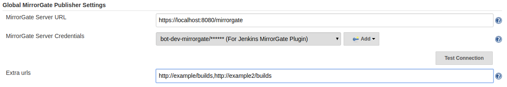

# MirrorGate plugin for Jenkins

## Download

You can download the collector's hpi from [Sonatype OSS](https://oss.sonatype.org/content/repositories/releases/com/bbva/arq/devops/ae/mirrorgate/mirrorgate-publisher/)

# Development instructions

Run unit tests

    ./gradlew test

Create an HPI file to install in Jenkins (HPI file will be in `target/mirrorgate-publisher.hpi`).

    ./gradlew clean build 

# Important
Last version of this plugin (v0.0.8-SNAPSHOT) supports Jenkins version 2.160 or newer. Check previous [release versions](https://github.com/BBVA/mirrorgate-jenkins-builds-collector/releases) for Jenkins older versions.

The main project is JDK 1.8 compiled, if you have Jenkins running on previous Java versions, make sure to recompile core package with that previous version and then build this Jenkins plugin.

## Jenkins pipeline 
1. Install the plugin by using "Advanced" option in Jenkins Plugin Management option to manually upload the file
from local disk.
2. Restart jenkins.
3. Configure Global MirrorGate Publisher in Jenkins Manage Jenkins/Configure System. Enter MirrorGate API URL such
 as `http://localhost:8080/mirrorgate/api`. 
4. Add the credentials to be used for the API call. This field can be empty if no credentials are needed.

5. You can, additionally, configure extra URLs that will receive the build information. This is done via POST and they don't use credentials. 